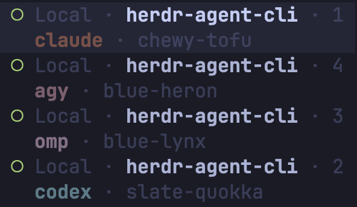

# herdr-agent-cli

The CLI behind each agent, in the Herdr sidebar, in its own colour.

[](https://herdr.dev)
[](https://www.python.org/)
[](#install)

한국어 문서: [README.ko.md](README.ko.md)



Herdr knows which runtime it detected — it keys `rows_by_agent` off it — but exposes no
built-in token for it. The `agent` token renders the *display name*, so the sidebar can
show `chewy-tofu` and never say whether a Claude Code, a Codex or an omp is behind it.
This plugin reports the runtime back to Herdr as pane metadata, which is the only way to
get it onto a row.

It pairs with [agent-auto-naming](https://github.com/azyu/herdr-agent-auto-naming), which
mints the name half. Neither needs the other, but the example above is both.

## Install

Requires Herdr 0.9.0+ and `python3` (standard library only) on macOS or Linux.

```sh
herdr plugin install azyu/herdr-agent-cli
```

The `cli` token shows nothing until a sidebar row renders it, and the rows that colour it
run to twenty-odd lines, so `configure.py` writes them into `~/.config/herdr/config.toml`
from a `[[startup]]` hook — not `[[build]]`, which gets no runtime environment and which
`herdr plugin link` skips entirely. A run with nothing to change writes nothing and
reloads nothing, so it adds nothing to a restart.

It writes between `# >>> azyu.agent-cli >>>` markers, keeps a backup, and restores the
original if `herdr server reload-config` rejects the result. If you already have an
`[ui.sidebar.agents]` block it refuses rather than produce a duplicate TOML table — TOML
does not allow the same table twice; delete yours and re-run, or paste the keys in by hand.

**If Herdr was already running when you installed, run this once** — the startup hook
fires when the server starts, so installing into a live server leaves the rows unwritten
and the sidebar unchanged until you either restart Herdr or say:

```sh
herdr plugin action invoke azyu.agent-cli.configure     # .unconfigure backs it out
```

It writes through symlinks, and prints the path it actually wrote to.

Agents already running when you installed it stay blank until swept:

```sh
herdr plugin action invoke azyu.agent-cli.refresh
```

## Colours

Defaults are the `PALETTE` list in `configure.py`. To change one, or to stop the plugin
touching Herdr's config at all, use the plugin's own config directory — it survives
plugin updates, and it is where Herdr's docs say user-editable config belongs:

```sh
$EDITOR "$(herdr plugin config-dir azyu.agent-cli)/config.toml"
```

```toml
colours = "off"        # never write to Herdr's config

[colors]
claude = "#ff8800"     # any canonical agent id; an unknown one is refused
```

## What it touches

One display-only pane metadata token, `cli`. The pane label and the agent name — the
durable identity auto-naming rebinds from — are left alone. The token is cleared as soon
as a pane stops hosting an agent, and the plugin writes only when the value would change,
because every metadata write repaints the sidebar and the status event is noisy.

It runs on `pane.agent_detected` and `pane.agent_status_changed`, at startup, and from the
**Refresh CLI labels** action.

## About that config

The runtime is a token of its own so it can carry its own colour: `pane report-metadata`
strips control characters, so colour cannot travel in the value. Herdr joins adjacent
tokens with `·` and that separator is not configurable, which is why the runtime and the
name cannot sit flush on one line.

Per-value styling comes from Herdr's token `rules`: the first match wins, its fields
override the token's, and unspecified fields are inherited — so `bold = true` on the token
survives a rule that sets only `fg`. A token takes **at most 16 rules**, and there are 22
canonical agent ids, so the six past the cap fall back to `rows_by_agent`, where each
entry replaces the whole layout and repeats row 1 verbatim — `configure.py` expands both
from one `ROW1` constant so they cannot drift.

Token foregrounds take `#RGB`/`#RRGGBB` only; `fg = "cyan"` is rejected with *did not
match any variant of untagged enum RawSidebarToken* (measured on Herdr 0.9.0). Named
colours work for `ui.accent`, not here.

`rows_by_agent` keys are validated: an id Herdr does not know is rejected with *unknown
canonical agent id*, and the whole ui config is kept at its previous state. The 22 above
are the entire set Herdr 0.9.0 accepts — `aider`, `goose`, `windsurf`, `zed`, `mastra` and
`antigravity-cli` are **not** among them, whatever the docs page lists. Colours are brand
where the CLI has one (`claude`, `gemini`, `grok`) and Catppuccin otherwise.

## If you only want colour, you do not need this

Herdr already knows the runtime. If telling the CLIs apart by colour is enough, style the
built-in `agent` token per runtime and skip the plugin entirely:

```toml
[ui.sidebar.agents.rows_by_agent]
claude = [["state_icon", "machine", "workspace", "tab"], [{ token = "agent", fg = "#d97757", bold = true }]]
codex  = [["state_icon", "machine", "workspace", "tab"], [{ token = "agent", fg = "#89dceb", bold = true }]]
```

That colours the name (`chewy-tofu`), not the runtime — the word `claude` never appears.
This plugin exists only to put that word on screen.

## Troubleshooting

**Nothing shows up.** Invoke the `configure` action — the startup hook only runs when the
Herdr server starts. If it refuses, you already have an `[ui.sidebar.agents]` block of your
own. `herdr pane list` shows the reported value under `tokens.cli` either way.

**A pane shows the name but no runtime.** It was running before the plugin was installed.
Run the `refresh` action.

**Every call fails.** After `brew upgrade herdr` the old server keeps running and every
command returns `protocol_mismatch`. Compare `herdr --version` against the server's start
time before suspecting the plugin.

## License

MIT
